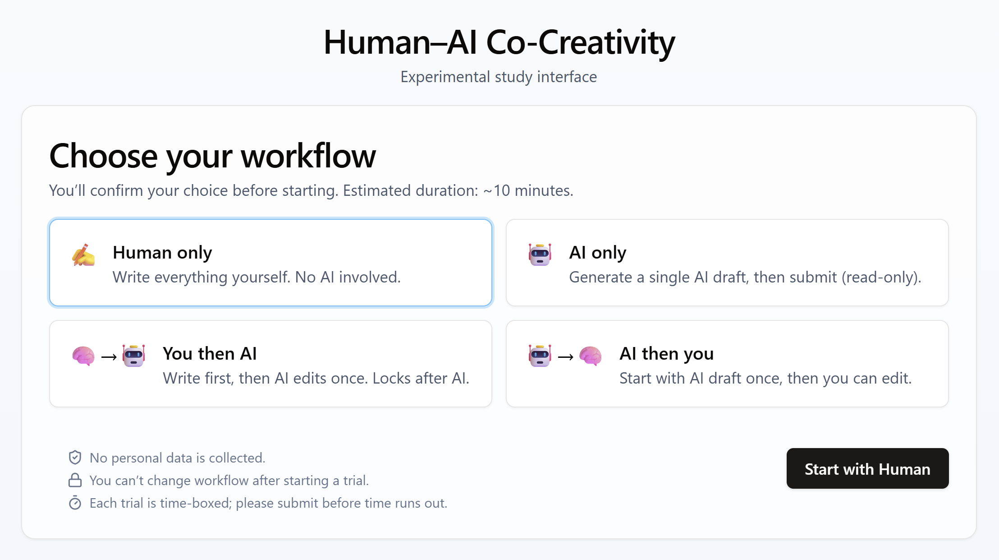

# **Human-AI Co-Creativity** 🧠🤖

[](https://vercel.com)
[](https://www.prisma.io)
[](https://nodejs.org/)
[](https://www.postgresql.org/)
[](https://github.com)

A platform designed to study human-AI collaboration by testing various workflow choices under time constraints.
The study measures task performance, workflow preferences, and trust in AI.

---

## **🚀 Demo - Try it Now!**

You can experience the **Human-AI Co-Creativity** platform in action by clicking the link below:

#### [👉 **human-ai-cocreativity.vercel.app**](https://human-ai-cocreativity.vercel.app)



---

## 📝 **Study Design**

The platform enables participants to complete tasks in the following four workflows:

- **Human-only**: The participant does everything by themselves.
- **AI-only**: The AI generates the entire output.
- **Human→AI**: The participant writes the task, then the AI edits it.
- **AI→Human**: The AI generates the draft, and the participant edits it.

The outputs are later stored anonymously and analyzed.

---

## 🛠️ **Project Setup**

### 1. **Install Dependencies**

Install the necessary dependencies:

```bash
npm install
```

### 2. **Start Development**

To start the development server locally, run:

```bash
make run
```

Then navigate to [http://localhost:3000](http://localhost:3000) in your browser to start interacting with the platform.

### 3. **Set up Environment Variables**

Create a `.env` file in the root of your project and define the database URL:

```env
PRISMA_DATABASE_URL="your-database-connection-string"
```

### 4. **Database Setup**

1. Make sure you have **PostgreSQL** set up.
2. Run the following command to apply the migrations to your local development database:

```bash
make migrate
```

3. You can open **Prisma Studio** to visually inspect your database by running:

```bash
make studio
```

---

## ⚙️ **Makefile**

This project includes a **Makefile** for automating common tasks.

### **Available Commands**:

```bash
# Generate Prisma Client
make gen

# Apply local migrations
make migrate

# Reset local database
make reset

# Deploy migrations to production
make deploy

# Open Prisma Studio
make studio

# Clean Prisma directories (migrations & generated)
make clean

# Rebuild Prisma (clean, generate & migrate)
make rebuild
```

---

## 💡 **Acknowledgements**

This project is part of a **Master Thesis** exploring human-AI collaboration and trust in AI. Special thanks to the participants for their contributions to the research!
